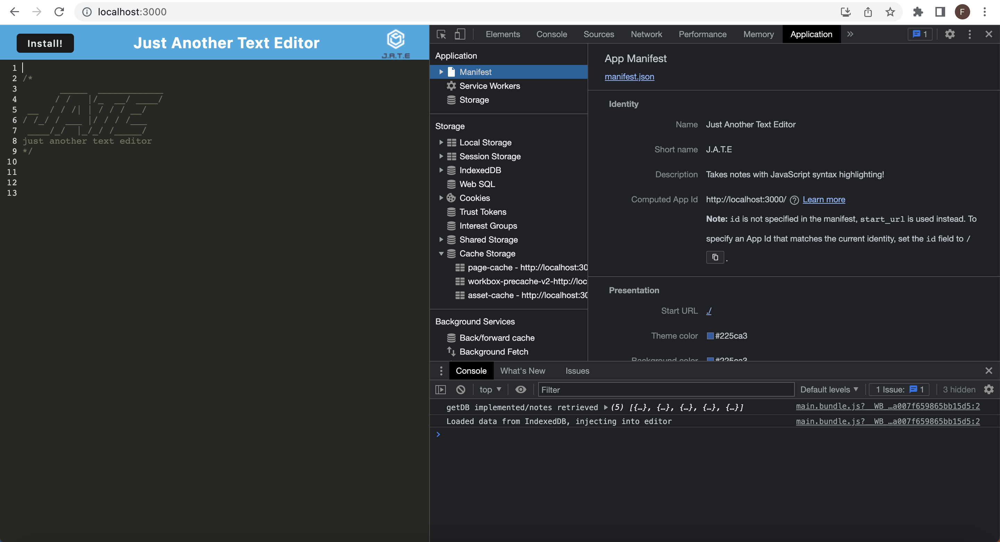
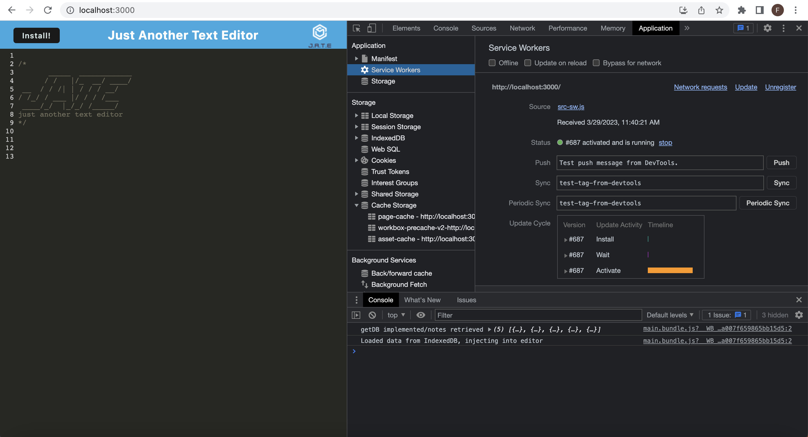
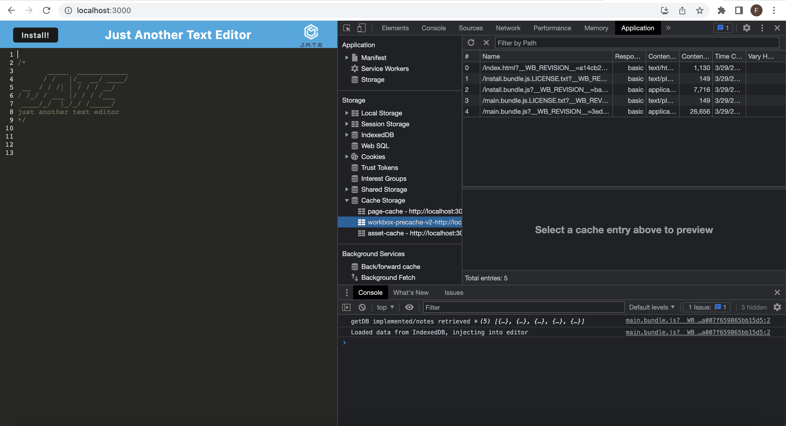
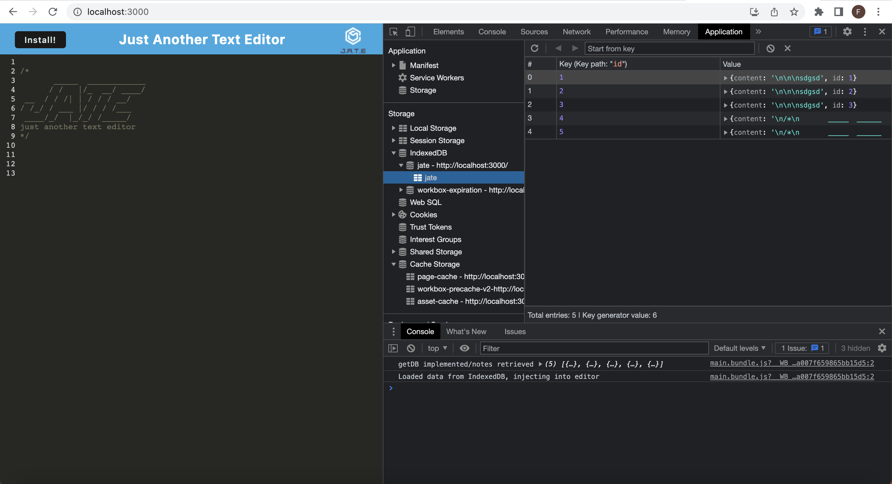
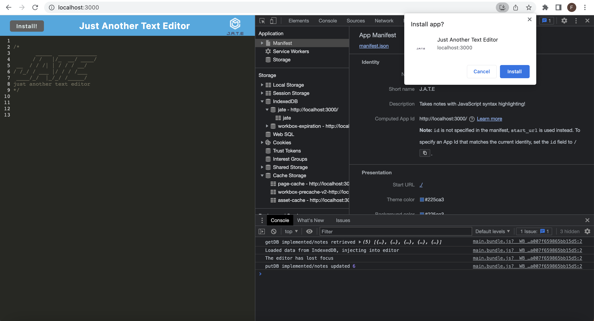
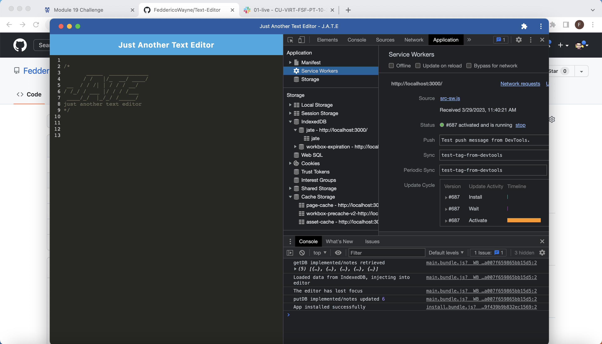

# Just Another Text Editor - "J.A.T.E" 

  ## <a id="Description">Description</a> 

  This is a PWA text editor that allows users to take notes of code snippets with JavaScript highlighting effect.

  It utilizes webpack, workbox, and various plugins to optimize user experience, as well as Google Chrome's IndexedDB.
  
  Upon starting the app, an IndexedDB database is immediated created for use. A service worker is also registered and the page is pre-cached in case of network disruption. The assets required for the app are also then cached by the service worker. Whenever the user clicks off the main app display, their input is updated inside the IndexedDB so that when the page is refreshed, the saved data can be retrieved for display.

  When the user clicks on the "Install" button on the top left corner of the PWA, the PWA is downloaded onto the user's local environment and is fully functional as a standalone app with its own caches, manifest, and service worker. 

  URL of the deployed PWA on Heroku:

  URL of the GitHub repo: https://github.com/FeddericoWayne/Text-Editor

  PWA Manifest screenshot:
  

  PWA Service Worker screenshot:
  

  PWA Caching screenshot:
  

  PWA IndexedDB screenshot:
  

  PWA Installation screenshot:
  

  PWA Successfully Installed screenshot:
  

***

  ## Table of Content

  ### [Description](#Description)
  ### [Installation](#Installation)
  ### [Usage](#Usage)
  ### [License](#License)
  ### [Contributing](#Contributing)
  ### [Tests](#Tests)
  ### [Questions](#Questions)

***

  ## <a id="Installation">Installation</a>

  If you'd like to git clone it from the repo for personal use, remember to install all the necessary npm packages and then in the terminal run "npm run start" to initiate the server and the front end. Otherwise, you can install the App from the Heroku URL by clicking on the "Install" button, and the app will be intalled locally for your device.
  

***

  ## <a id="Usage">Usage</a>

  This is a PWA for note taking. If you're entering notes in JavaScript format, it will be highlighted in JavaScript style!

***

  ## <a id="License">License</a>
  
  This App is covered under the MIT license.

  
***

  ## <a id="Contributing">Contributing</a>

  Please refer to the Question section of this README for my contact information if you'd like to contribute to this project!

***

  ## <a id="Tests">Tests</a>

  N/A
  

***

  ## <a id="Questions">Questions</a>

  For more info on my work, please check out my GitHub page at: https://github.com/feddericowayne
  
  Should you have any further questions regarding this App, please don't hesitate to reach out to me via email at: <a href="mailto:jackiew1120@hotmail.com">jackiew1120@hotmail.com</a>

  
